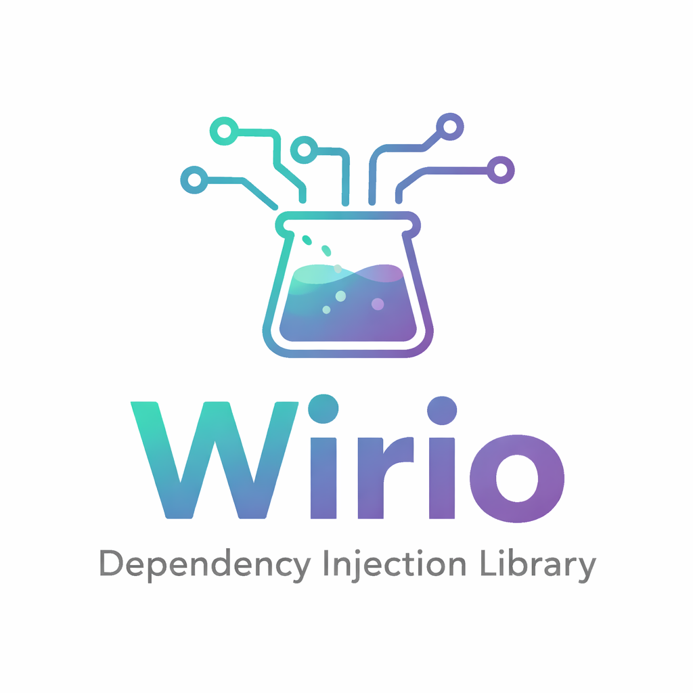

<div align="center">


[](https://github.com/AndreuCodina/aspy-dependency-injection/actions/workflows/main.yaml)
[](https://coveralls.io/github/AndreuCodina/aspy-dependency-injection?branch=main)
[](https://pypi.org/project/aspy-dependency-injection/)
[](https://github.com/AndreuCodina/aspy-dependency-injection/blob/main/LICENSE)
</div>

## Features
- **Use it everywhere:** Use dependency injection in web servers, background tasks, console applications, Jupyter notebooks, tests, etc.
- **Lifetimes**: `Singleton` (same instance per application), `Scoped` (same instance per HTTP request scope) and `Transient` (different instance per resolution).
- **FastAPI integration** out of the box, and pluggable to any web framework.
- **Automatic resolution and disposal**: Automatically resolve constructor parameters and manage async and non-async context managers. It's not longer your concern to know how to create or dispose services.
- **Clear design** inspired by one of the most used and battle-tested DI libraries, adding async-native support, important features and good defaults.
- **Centralized configuration**: Register all services in one place using a clean syntax, and without decorators.
- **ty** and **Pyright** strict compliant.

## Installation
```bash
uv add aspy-dependency-injection
```

## Quickstart

Register services and resolve them asynchronously.

```python
class EmailService:
    pass

class UserService:
    def __init__(self, email_service: EmailService) -> None:
        self.email_service = email_service
    
services = ServiceCollection()
services.add_transient(EmailService)
services.add_transient(UserService)

async def main() -> None:
    async with services.build_service_provider() as service_provider:
        user_service = await service_provider.get_required_service(UserService)


if __name__ == "__main__":
    asyncio.run(main())
```

## FastAPI integration

Inject services into async endpoints using `Annotated[..., Inject()]`.

```python
class EmailService:
    pass

class UserService:
    def __init__(self, email_service: EmailService) -> None:
        self.email_service = email_service

app = FastAPI()

@app.post("/users")
async def create_user(user_service: Annotated[UserService, Inject()]) -> None:
    pass

services = ServiceCollection()
services.add_transient(EmailService)
services.add_transient(UserService)
FastApiDependencyInjection.setup(app, services)
```

## Factories

Register with sync or async factories:

```python
# TBD
```

Automatic disposal: Services implementing `__exit__`/`__aexit__` are disposed when the provider or scope exits.

Example of a real application using SQLModel:

```python
# TBD
```

## Testing

TBD
