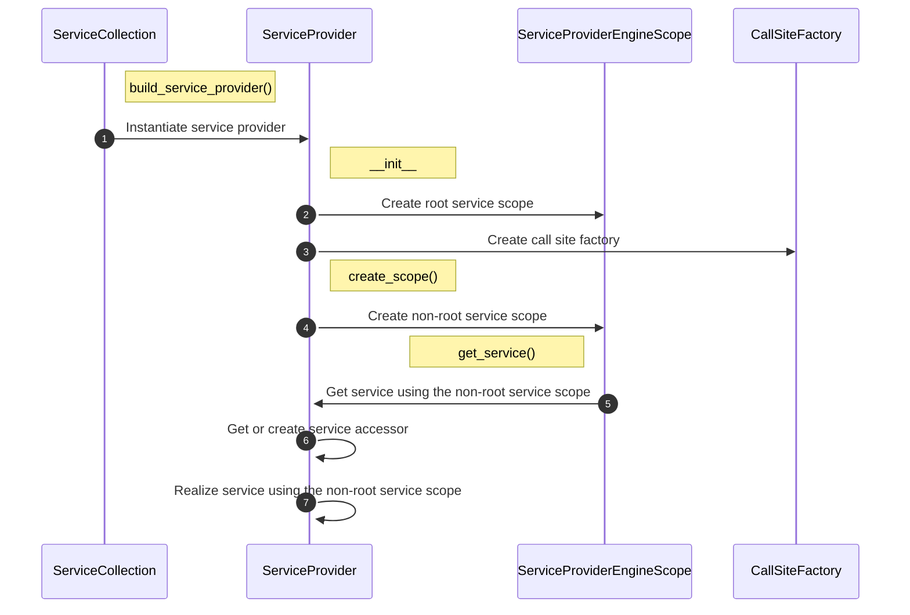

# Diagrams

## Sequence diagram

```mermaid
sequenceDiagram
    autonumber
    participant ServiceCollection
    participant ServiceProvider
    participant ServiceProviderEngineScope
    participant CallSiteFactory

    Note right of ServiceCollection: build_service_provider()
    ServiceCollection->>ServiceProvider: Instantiate service provider
    activate ServiceProvider

    Note right of ServiceProvider: __init__
    ServiceProvider->>ServiceProviderEngineScope: Create root service scope
    ServiceProvider->>CallSiteFactory: Create call site factory
    Note right of ServiceProvider: create_scope()
    ServiceProvider->>ServiceProviderEngineScope: Create non-root service scope
    activate ServiceProviderEngineScope

    Note left of ServiceProviderEngineScope: get_service()
    ServiceProviderEngineScope->>ServiceProvider: Get service using the non-root service scope
    activate ServiceProvider

    ServiceProvider->>ServiceProvider: Get or create service accessor
    ServiceProvider->>ServiceProvider: Realize service using the non-root service scope
```
